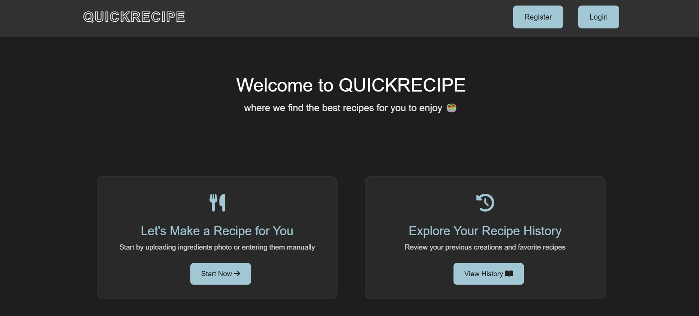

# Recipe Finder App 🍳

[](https://python.org)
[](https://flask.palletsprojects.com/)

A web service that recommends recipes based on ingredients detected from images or manual input and user preferences.


## Features ✨
- 🖼️ Image-based ingredient detection
- ✍️ Manual ingredient input with autocomplete
- 🧑‍🍳 Recipe recommendations based on preferences
- 🔐 User authentication
- 📱 Responsive design


*Home Page*


*Image upload interface with drag-and-drop*


*Recommended recipes based on ingredients*

## Installation ⚙️
1. Clone repository:
```bash
git clone https://github.com/ThunderH4/Recipe-Finder-WebApp.git
cd Recipe-Finder-WebApp
```

2. Create virtual environment:
```bash
python -m venv venv
source venv/bin/activate  # Linux/Mac
venv\Scripts\activate  # Windows
```

3. Install dependencies:
```bash
pip install -r requirements.txt
```

4. Create `.env` file:
```env
SECRET_KEY=your_secret_key
DATABASE_URL=sqlite:///recipeapp.db
SPOONACULAR_API_KEY=your_api_key
IMAGGA_API_KEY=your_imagga_key
IMAGGA_API_SECRET=your_imagga_secret
EDAMAM_API_USER_ID=your_edamam_user_id
EDAMAM_API_APP_KEY=your_edamam_app_key
EDAMAM_API_APP_ID=your_edamam_app_id
```

5. Run the app:
```bash
flask run
```

## Usage 🚀
1. Register/Login
2. Choose input method:
   - 📸 Upload ingredient image
   - ⌨️ Manual ingredient entry
3. Set preferences (diet, time, etc.)
4. Get recipe recommendations

## API Keys 🔑
Get free API keys from:
- [Spoonacular](https://spoonacular.com/food-api)
- [Imagga](https://imagga.com/)
- [Edamam](https://www.edamam.com/)